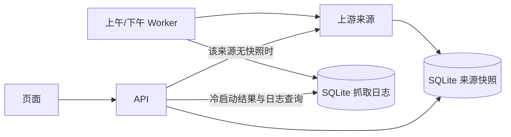

# 定时 Worker 与数据库优先读取实现计划

## 需求理解

- **目标**：停止目前的分钟级上游轮询。上午和下午由独立 Worker 批量更新本地数据库；用户打开页面、切换分类或点击重载时读已保存的数据。某来源从未保存过数据时，API 才抓取该来源，写入数据库成功后返回本次结果。页面提供“抓取日志”按钮，供用户查看定时任务与冷启动抓取的结果和时间。
- **范围假设**：作用于全部已启用来源，默认北京时间 `09:00`、`15:00` 两个时段；时区与时间通过 Worker 配置设置。用户若指定其他范围或时间，实施前按其答复更新本计划。现有来源开关继续决定 Worker 和页面能看到哪些来源。
- **现状**：`apps/api/src/services/scheduler.js` 在应用进程启动后错峰预热，并按来源定义的 `refreshIntervalMs` 每 5–15 分钟强制抓取；`apps/api/src/services/hot-service.js` 在快照过期、`refresh=true` 或没有快照时也抓上游。`apps/api/src/services/cache-service.js` 先读进程内 LRU，之后才读 SQLite 的 `source_snapshots`，因此单独的 Worker 更新数据库后，API 进程可能继续看到旧内存值。前端 `useSources.js` 的全部/单源刷新会发起强制刷新。生产环境目前只有一个 `news-spot` 容器，SQLite 位于共享命名卷。
- **方案**：新增使用同一镜像、同一 SQLite 卷的独立 Worker 容器；API 与 Worker 共用一套“抓取、校验、写入快照、记录抓取结果”流程。将 `get` 改成数据库优先且不因时间到期抓取，只有快照完全不存在时进入冷启动流程。计划任务单独调用显式的 `refreshSource`。页面通过只读分页 API 查看 SQLite 中的结构化抓取记录，不读取容器原始日志。保留现有来源适配器、错误隔离和上游限流约定。

## 一、让 SQLite 成为读取事实来源

涉及文件：`apps/api/src/services/cache-service.js`、`apps/api/src/db/index.js`、拟新增 `apps/api/src/db/migrations/002_worker.sql`、`apps/api/test/services.test.js`。

1. `cache.get(sourceId)` 每次查询 `source_snapshots`，不再直接返回进程内 LRU 的旧值；沿用现有 `source_id` 主键和一次成功写入替换整份 JSON 快照的方式。写入在同一事务内完成，异常时不改变上一成功快照；保存完再让 API 返回结果。保留 SQLite WAL、`busy_timeout` 与现有数据卷，不清库、不重建历史快照。
2. 新增幂等迁移，用于跨进程的逐来源抓取租约、Worker 时段执行记录/心跳、逐来源抓取记录，以及需要跨进程遵守的上游退避时间。抓取记录至少保存来源 ID、触发方式（定时/冷启动）、所属时段、开始与结束时间、结果（成功/未变化/失败/跳过）、入库条数和公开安全的错误码；为按时间倒序分页和来源筛选建立索引。迁移脚本由 `db/index.js` 按顺序执行；API 先完成迁移，Worker 再启动。租约过期后可恢复，避免 Worker 崩溃造成永久锁死。
3. 用两个独立 SQLite 连接做测试：Worker 连接写入后，API 连接下一次读取立即得到新快照；模拟写入失败仍返回上一完整快照，租约过期后可重新领取。

## 二、拆分读流程、计划抓取与冷启动流程

涉及文件：`apps/api/src/services/hot-service.js`、`apps/api/src/app.js`、`apps/api/src/routes/hot.js`、`apps/api/src/routes/batch.js`、`apps/api/src/routes/sources.js`、`apps/api/src/lib/refresh-limiter.js`、`apps/api/src/sources/aihot.js`、`apps/api/test/routes.test.js`、`apps/api/test/services.test.js`。

1. 将共享的数据库、来源注册表、HTTP 客户端和抓取服务从 `app.js` 提取为 API/Worker 可复用的运行时工厂。抓取路径统一执行“来源适配器 → 条目契约校验 → SQLite 快照替换 → 成功指标和抓取记录”；抓取失败也结束该次抓取记录、记录失败指标，不覆盖已保存数据。普通数据库读取不写抓取日志，避免用户重载刷出虚假的抓取事件。
2. `get(sourceId)` 与 `batch` 默认只读数据库。数据库有该来源快照时，直接按 `limit` 返回；到达旧 `expires_at` 不再触发上游请求。若快照早于最近一个应完成的时段，返回 `stale` 和实际更新时间，仍展示已保存的内容；不把“定时更新尚未完成”说成“上游当前不可用”。超过原先 24 小时的快照也继续作为旧数据展示，直到 Worker 更新成功或来源被关闭。
3. 若数据库中完全没有该来源快照，由 API 对该来源申请 SQLite 租约。获得者调用上游并同步写库，写成功后重新从数据库读取返回；未获得者等待同一来源的结果并读库，避免 Worker 与多个网页请求同时抓取。冷启动等待设置明确上限，并核对 Fastify 与生产 Nginx 的超时配置；上游失败或超过等待上限时返回明确错误，页面不显示伪数据。不同来源互不阻塞，`batch` 保持部分成功。
4. `refresh=true` 停止作为公网强制抓取入口：给旧参数返回明确的 `REFRESH_DISABLED` 错误，前端改为普通数据库重载。原有 IP 刷新限流器可删除；冷启动改用逐来源租约和既有全局请求限流。`/api/v1/sources`、`/api/v1/health` 的来源状态也只根据数据库快照和 Worker 最近日程/错误计算，不产生上游请求。
5. AIHOT 的 ETag、`s-maxage`、429 `Retry-After` 约定继续由适配器遵守；跨进程共享的退避截止时间写入 SQLite，防止 Worker 遇到 429 后冷启动请求立刻再次访问。Worker 重启后可重新发送普通 GET，不能复用旧进程内的 ETag 假定已有相应响应体。

## 三、新增每日两次运行的独立 Worker

涉及文件：拟新增 `apps/api/src/worker.js`、拟新增 `apps/api/src/services/worker-schedule.js`，替换或移除 `apps/api/src/services/scheduler.js`，`apps/api/src/config/env.js`、`apps/api/package.json`、`.env.example`、`apps/api/test/services.test.js`。

1. Worker 不监听 HTTP 端口；使用同一来源注册表和抓取服务，默认以 `TZ=Asia/Shanghai` 的本地日历在 `09:00`、`15:00` 触发。时间配置需校验，定时计算每分钟重新评估一次，不依赖进程启动时的一次长计时器。启动时检查最近应执行时段：未完成则补跑；同一时段通过 SQLite 唯一键与租约保证只有一个执行者。
2. 每个时段对所有已启用来源执行独立抓取，最多并发 3 个，分别记录成功/失败和每次抓取耗时、条数。单源失败不终止整批，也不覆盖其旧快照；时段记录包括开始、完成、失败来源与下一次运行时间。进程中途退出时，租约过期后可继续未完成的来源；已完成的来源不重复抓取。冷启动抓取使用相同的逐来源日志结构，标记不同触发方式。
3. 关闭 API 进程中的旧分钟级调度器；`SCHEDULER_ENABLED` 迁移为 Worker 开关或删除，并更新启动命令。来源定义的 `refreshIntervalMs` 在公开契约中暂保留以避免破坏旧客户端，但不再用于后台轮询，文档明确其已废弃；新的 Worker 时刻才是实际更新频率。
4. 给 Worker 增加数据库心跳与最近运行信息。API 健康/指标接口可读取心跳，Worker 失联或连续时段未执行时明确降级；不会因已有旧快照而误报定时任务正常。

## 四、让页面只执行数据库重载

涉及文件：`apps/web/src/composables/useSources.js`、`apps/web/src/services/api.js`、`apps/web/src/components/AppHeader.vue`、`apps/web/src/components/SourceCard.vue`、`apps/web/src/composables/useSources.test.js`、`apps/web/src/components/SourceCard.test.js`、`tests/e2e/news-spot.spec.js`。

1. 首页仍按现有 6 个来源一批渐进加载，但请求现在只命中数据库；首次无数据的来源由后端冷启动，不需要前端专用分支。顶部和卡片按钮改为“重新加载”，只重新读取 API，不附 `refresh=true`；失败按钮可再次读取，若仍无快照则由后端受控重试。
2. 来源卡片明确展示“更新于”时间；按最近计划时段标记旧快照，不把正常的上午/下午间隔误标过期。搜索、分类、布局和主题保持现有行为。
3. 用注入式假 API 与 Playwright 拦截验证：常规加载、重复重载不触发上游；冷启动数据落库后出现；定时更新后页面下次重载读到新数据；某来源失败不影响其他来源；旧数据有准确的更新时间和状态。

## 五、提供抓取日志按钮与只读接口

涉及文件：拟新增 `apps/api/src/routes/fetch-logs.js`、拟新增 `apps/api/src/services/fetch-log-service.js`、`apps/api/src/app.js`、`packages/contracts/src/index.js`、`apps/web/src/App.vue`、`apps/web/src/components/AppHeader.vue`、拟新增 `apps/web/src/components/FetchLogsDialog.vue`、`apps/web/src/services/api.js`、`apps/web/src/styles/global.less`、`apps/api/test/routes.test.js`、拟新增 `apps/web/src/components/FetchLogsDialog.test.js`、`tests/e2e/news-spot.spec.js`。

1. 服务端新增只读 `GET /api/v1/fetch-logs`，默认返回最近 20 条、最多 100 条，按时间和 ID 稳定倒序分页；支持来源与结果筛选，返回 `items` 和不透明 `nextCursor`，并附最近定时时段的开始、完成及总体结果。参数不合法返回明确 400；数据库查询失败走现有安全错误格式。接口不调用上游、不触发冷启动。
2. 公网响应只包含来源、触发方式、时间、耗时、状态、入库条数及安全错误码/简述；不输出原始上游响应、完整 URL、Token、堆栈或容器日志。数据库保留最近 30 天的逐来源抓取记录，Worker 每日维护时分批清理过期记录；时段运行摘要保留更长时间供健康判断，清理不影响快照。
3. 在页头增加“抓取日志”按钮，移动端同样可见。点击后打开与现有界面风格一致的对话框，首次打开才请求日志；显示最近时段概览、逐来源列表、定时/冷启动标识、时间、成功条数和安全错误原因。提供来源/状态筛选、“加载更多”和手动“重新加载日志”；包含加载、空列表、失败状态及关闭按钮，窄屏可滚动且键盘可操作。关闭后不持续轮询。
4. 测试真实抓取与 304、429、冷启动失败各只产生对应记录；普通页面读取和重复打开日志不产生抓取记录。接口测试覆盖过滤、分页、字段脱敏与 30 天清理；组件/浏览器测试覆盖按钮、对话框、筛选、空态、错误态、分页和移动端布局。

## 六、部署、迁移和验收

涉及文件：`deploy/compose.prod.yaml`、`compose.yaml`、`Dockerfile`、`scripts/deploy.mjs`、`README.md`、`apps/api/scripts/smoke.js`、必要时 `deploy/nginx/hot-spots.kevinlau.cn.conf.example`。

1. Compose 新增 `news-spot-worker` 服务，复用现有镜像、环境文件和 `news-spot-data` 卷，设置 `TZ=Asia/Shanghai`，不暴露端口；API 容器不再运行分钟级调度。Worker 等 API 完成迁移后启动。保留现有数据卷中的快照，迁移仅增加控制表。
2. 发布脚本同时校验 API 容器健康、Worker 容器运行/心跳和公网接口；任一关键检查失败时，连同两个容器回滚到上一镜像。生产 Nginx 冷启动读取超时与后端实际最长等待一致；先预演再发布。
3. 本地可通过 Worker 一次性运行模式验证抓取并落库，普通 `/api/v1/batch` 重复读取不能增加上游请求计数或抓取日志条数。部署后验证两个时段的执行记录、页面抓取日志列表、成功/失败来源、数据库时间戳、页面更新时间、冷启动空库场景和 AIHOT 退避。README 更新实际频率、冷启动行为、旧数据含义、抓取日志保留期、手动重载与回滚方法。

## 完整需求专项检查

- **接口 Mock**：项目已有 `apps/api/test/fixtures/upstreams/`、可注入的 `http`/`fetchImpl` 和 Playwright 路由拦截；沿用它们模拟 Worker 成功、单源失败、429 与冷启动，不引入生产 Mock。
- **单元测试**：已配置 Vitest、Fastify inject、Vue Test Utils。主要验证两个 SQLite 连接的读写可见性、同源租约、定时计算及补跑、成功落库后返回、已有快照时上游调用次数为零、逐次抓取日志、分页/脱敏/保留期、部分失败和旧快照状态。浏览器与在线 smoke 用于验证页面和实际部署。

## 验证顺序

1. `pnpm --filter @news-spot/api test`：数据库跨连接、Worker 时段、租约、冷启动写库、无快照失败、AIHOT 退避，以及抓取日志写入、查询、脱敏和清理。
2. `pnpm --filter @news-spot/web test`、`PLAYWRIGHT_HTML_OPEN=never pnpm test:e2e`：数据库重载按钮、更新时间、旧数据、局部失败和抓取日志对话框。
3. `pnpm typecheck && pnpm lint && pnpm build`；`npm run deploy:dry-run` 检查双容器发布、健康验证和回滚步骤。
4. 非生产空库演练：首次请求抓取后确认 `source_snapshots` 与抓取记录均已写入，再发同一请求确认不访问上游也不新增日志；Worker 一次性运行后确认 API 读取更新的快照，页面日志可看到时段和逐来源结果。
5. 生产发布后核对 Worker 心跳与下一时段、`/api/v1/health`、`/api/v1/metrics`、`/api/v1/fetch-logs` 和公网页面；至少跨过一次上午或下午时段确认自动抓取、页面数据及日志同步更新，并保留旧镜像和 SQLite 卷作为回退条件。

## 明确不做

- 不增加第三方任务队列、Redis 或远端数据库；单机双容器与现有 SQLite WAL 足以覆盖当前部署。
- 不在每次页面访问、按钮点击或快照过期时刷新上游；仅定时任务与无快照冷启动可以抓取。
- 不清理现有真实快照，不因单来源失败清空页面数据，不改变 AIHOT 来源授权与原文/署名链接约定。
- 不在公开抓取日志中展示原始响应、请求头、密钥、堆栈或全文，也不把普通数据库读取记作抓取。

## 实施跟踪规则

- 实施过程中以本文末尾 TODO 为进度依据。
- 开始任务前先读取 TODO；每完成一个可独立验收的交付项并通过相关验证后，立即将对应的 `- [ ]` 更新为 `- [x]`。
- 不要等全部开发结束后一次性勾选，不得在缺少验证结果时提前勾选。
- 遇到阻塞时保持未勾选，并在该项后补充阻塞原因。
- 新发现的必要工作应补充为新的 checkbox，不得删除未完成事项。

## TODO

- [x] 迁移 SQLite 控制表并改成数据库优先读取，完成跨连接可见性和写入原子性测试。
- [x] 拆分普通读取、Worker 显式抓取和无快照冷启动流程，完成租约、限流和路由测试。
- [x] 实现北京时间每天两次的独立 Worker、补跑和心跳，完成定时及部分失败测试。
- [x] 将前端刷新改为数据库重载，完成组件与端到端验证。
- [x] 建立逐来源抓取日志、只读分页接口及页面查看按钮，完成脱敏、筛选、保留期和移动端验证。
- [x] 更新双容器部署、回滚、监控和文档，完成非生产空库演练、生产发布与启动补跑验收。
- [ ] 在 2026-09-24 09:00 北京时间之后核对首次自然定时触发的时段、来源日志与页面快照。当前已验证 2026-09-23 15:00 时段的启动补跑（15/15 成功）；自然时刻尚未到来。
