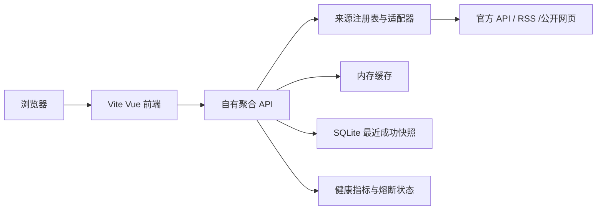

# 真实数据新闻热点聚合站实现计划

## 需求理解

- **目标**：实现一个可独立部署的热点聚合站，具备分类、搜索、网格/列表切换、深浅主题、来源卡片、局部刷新和来源健康状态；生产页面只展示真实上游数据，不把 Mock、硬编码榜单或参考站 API 当作正式数据源。
- **现状**：`/Users/peanut/Projects/news-spot` 当前为空目录，没有脚手架、依赖、测试或部署配置。参考站为 Nuxt 全栈应用，运行态展示 37 张来源卡；其公开接口在 2026-08-21 返回 28 个启用源，但健康接口仅报告 12 个健康、8 个不健康、10 个未知，说明“源数量”不等于“真实可用性”。
- **参考站边界**：参考仓库 README 声称 MIT，但实际仓库没有 `LICENSE` 文件。实施阶段不得直接复制其源代码、品牌名称、Logo 或部署密钥；只复刻公开可观察的产品结构和交互模式。若后续取得明确许可，再单独评估代码复用。
- **项目约定**：新前端按 `init-vite-vue-web` 采用 pnpm、Vite 8、Vue 3 JavaScript 模板和 Less。真实数据抓取不能放在浏览器端，因此使用同一 pnpm workspace 下的独立 Node.js API 服务。
- **方案**：建立 `apps/web`、`apps/api`、`packages/contracts` 三个工作区。API 服务以来源适配器统一数据格式，使用内存加 SQLite 两级缓存；前端只调用自有 API。首版交付 6 个已现场验证可返回数据的来源，第二阶段再接入依赖非公开接口或反爬策略的来源。
- **视觉基线**：完整三维 Design DNA 已记录在 [`docs/plans/newshub-reference.design-dna.json`](newshub-reference.design-dna.json)，实现时以它约束色彩、排版、栅格、卡片状态和轻量动效。

## 已验证的数据源与分期

| 分期 | 来源 | 上游方式 | 2026-08-21 只读探测结果 | 首版策略 |
|---|---|---|---|---|
| P0 | Hacker News | 官方 Firebase API | `topstories.json` 返回 200 和实时 ID 列表 | 首版必须交付 |
| P0 | V2EX | 公开 API | `/api/topics/hot.json` 返回 200 和主题数据 | 首版必须交付 |
| P0 | GitHub | 官方 REST Search API | 未认证请求返回实时仓库数据 | 首版交付；配置 Token 后提高限额 |
| P0 | BBC World | 官方 RSS | RSS 返回 200 | 首版必须交付 |
| P0 | IT之家 | 官方站 RSS | RSS 返回 200 | 首版必须交付 |
| P0 | 哔哩哔哩排行榜 | 公开 Web JSON 接口 | 排行接口返回 200、`code: 0` | 首版交付；标注非正式开放 API 风险 |
| P1 | 微博、知乎、抖音 | 非公开 JSON 或页面解析 | 参考站当天可取数，但长期稳定性和使用边界不明确 | 完成合规与稳定性验证后逐个启用 |
| P1 | 36氪、少数派、澎湃等 | RSS 或页面解析 | 参考站部分源已超时或空数据 | 不计入首版验收承诺 |

真实数据定义：每条榜单必须携带来源 ID、来源名称、原始标题、原文 URL、上游排名或热度、抓取时间和数据时间（上游提供时）；用户点击必须落到原始来源，禁止生成虚构详情页。

## 一、初始化工作区与质量门禁

涉及文件（拟新增）：[`package.json`](../../package.json)、[`pnpm-workspace.yaml`](../../pnpm-workspace.yaml)、[`.editorconfig`](../../.editorconfig)、[`.gitignore`](../../.gitignore)、[`apps/web/package.json`](../../apps/web/package.json)、[`apps/api/package.json`](../../apps/api/package.json)、[`packages/contracts/package.json`](../../packages/contracts/package.json)

1. 使用 `pnpm create vite@8 apps/web --template vue` 创建 Vue 3 JavaScript 前端并安装 Less；根目录只负责 workspace 脚本和统一版本约束。
2. 新建 Node.js API 工作区，使用 Fastify、Zod、Pino、`better-sqlite3` 和原生 `fetch`；统一要求 Node.js 22 LTS 及以上。选择 Fastify是为了使用内置注入测试、schema 校验和成熟的超时/限流插件，不引入完整 SSR 框架。
3. `packages/contracts` 维护前后端共享的 Zod schema 和 JSDoc 类型，至少包含 `SourceDefinition`、`HotItem`、`SourceResult`、`BatchResponse`、`HealthResponse` 和统一错误结构。
4. 根脚本提供 `pnpm dev`、`pnpm build`、`pnpm test`、`pnpm lint`、`pnpm typecheck`、`pnpm test:e2e`；并行开发时同时启动 Web 与 API，前端通过 Vite proxy 访问 `/api`。

验收：执行 `pnpm install && pnpm build && pnpm test`；三个 workspace 均能被根脚本发现，前端构建产物和 API 启动入口可生成。

## 二、定义真实数据契约和来源注册表

涉及文件（拟新增）：[`packages/contracts/src/index.js`](../../packages/contracts/src/index.js)、[`apps/api/src/sources/registry.js`](../../apps/api/src/sources/registry.js)、[`apps/api/src/config/env.js`](../../apps/api/src/config/env.js)、[`apps/api/src/config/sources.js`](../../apps/api/src/config/sources.js)

1. 统一 `HotItem`：`id`、`sourceId`、`title`、`url`、`rank`、`score`、`summary`、`publishedAt`、`fetchedAt`；其中 `title`、`url`、`rank`、`fetchedAt` 必填，未知值使用 `null`，不得用伪造值补齐。
2. 统一 `SourceDefinition`：`id`、`name`、`category`、`homeUrl`、`refreshIntervalMs`、`timeoutMs`、`enabled`、`riskLevel`、`dataMethod`；来源元数据与抓取实现分离。
3. 适配器只返回标准化列表，不自行操作 HTTP 响应或缓存。注册表负责查找适配器、启停来源和暴露公开元数据。
4. 环境变量至少支持 `PORT`、`HOST`、`DATABASE_PATH`、`GITHUB_TOKEN`、`CORS_ORIGINS`、`LOG_LEVEL` 和 `SOURCE_*_ENABLED`；使用 Zod 在进程启动时校验，不读取或记录密钥值。
5. URL 仅允许 `http`/`https`，标题去除不可见字符并限制长度；保留原始来源 URL，不做内容镜像。

验收：契约单元测试覆盖合法数据、缺少必填字段、非法 URL、重复 ID、未知来源和环境变量错误；任一适配器输出不符合 schema 时，该来源失败但进程不崩溃。

## 三、实现首批 6 个真实数据适配器

涉及文件（拟新增）：[`apps/api/src/sources/hackernews.js`](../../apps/api/src/sources/hackernews.js)、[`apps/api/src/sources/v2ex.js`](../../apps/api/src/sources/v2ex.js)、[`apps/api/src/sources/github.js`](../../apps/api/src/sources/github.js)、[`apps/api/src/sources/bbc.js`](../../apps/api/src/sources/bbc.js)、[`apps/api/src/sources/ithome.js`](../../apps/api/src/sources/ithome.js)、[`apps/api/src/sources/bilibili.js`](../../apps/api/src/sources/bilibili.js)、[`apps/api/src/lib/http-client.js`](../../apps/api/src/lib/http-client.js)、[`apps/api/src/lib/rss.js`](../../apps/api/src/lib/rss.js)

1. `http-client` 统一设置可识别的 User-Agent、连接/响应超时、最多 2 次指数退避加随机抖动重试，并保留上游状态码和耗时；`4xx` 默认不重试，`408`、`429`、`5xx` 和网络错误按来源策略重试。
2. Hacker News 先取 top story ID，再有界并发读取 item；过滤已删除、无标题或无 URL 的条目，Ask HN 等无外链条目指向其官方讨论页。
3. V2EX 读取公开热门主题 API，使用主题 ID、标题、URL、回复数和时间字段标准化。
4. GitHub 使用 REST Search API，查询最近 7 天创建并按 stars 排序的仓库；有 Token 时认证，无 Token 时仍可运行但在健康信息中提示低速率限制。不要把 GitHub Trending HTML 解析伪装成官方 API。
5. BBC 和 IT之家使用 RSS 解析器；支持 RSS 2.0、CDATA、时区和缺失发布日期，原文链接作为稳定 ID 的输入。
6. Bilibili 读取排行榜 JSON，校验顶层 `code === 0`，提取稿件 ID、标题、播放/点赞等统计和原视频 URL；将该来源标记为 `riskLevel: medium`，接口契约变化时自动降级旧数据。
7. 对标题和 URL 生成稳定去重键，同一来源按上游排名排序；跨来源首版不做标题聚类，避免误合并。

验收：每个适配器使用录制的上游响应 fixture 做确定性单测，并至少完成一次显式的在线 smoke test；上线验收要求 6 个来源中至少 5 个返回非空真实数据，失败来源必须给出可观察错误而不是空数组冒充成功。

## 四、实现缓存、调度、熔断和健康度

涉及文件（拟新增）：[`apps/api/src/services/hot-service.js`](../../apps/api/src/services/hot-service.js)、[`apps/api/src/services/cache-service.js`](../../apps/api/src/services/cache-service.js)、[`apps/api/src/services/scheduler.js`](../../apps/api/src/services/scheduler.js)、[`apps/api/src/services/circuit-breaker.js`](../../apps/api/src/services/circuit-breaker.js)、[`apps/api/src/db/migrations/001_init.sql`](../../apps/api/src/db/migrations/001_init.sql)、[`apps/api/src/db/index.js`](../../apps/api/src/db/index.js)

1. 建立内存 LRU 和 SQLite 两级缓存。SQLite 保存每个来源最近成功快照、抓取时间、过期时间、内容哈希及最近错误摘要，保证服务重启后仍能返回最近一次真实数据。
2. 正常 TTL 使用来源定义中的刷新间隔；请求命中未过期缓存直接返回。缓存过期时只允许一个刷新任务执行，其他请求读取旧数据或等待同一 Promise，避免击穿。
3. 上游失败时返回最近成功快照并标记 `stale: true`、`staleReason` 和 `lastSuccessAt`；旧数据最大保留 24 小时，超过后返回明确的 `SOURCE_UNAVAILABLE`，不得继续显示为“实时”。
4. 连续 3 次失败后打开来源熔断器 5 分钟；半开状态仅放行一个探测请求。调度器按来源刷新周期加抖动预热，进程退出时停止调度并安全关闭数据库。
5. 记录来源成功率、连续失败数、平均/P95 耗时、缓存命中、最近成功和最近错误；日志只记录来源、状态、耗时和错误类别，不记录响应正文或凭据。

验收：单测覆盖缓存命中、并发去重、过期刷新、上游超时、旧数据降级、24 小时淘汰、熔断开闭和进程重启恢复；用假时钟验证时间相关逻辑。

## 五、提供自有 API 与安全边界

涉及文件（拟新增）：[`apps/api/src/app.js`](../../apps/api/src/app.js)、[`apps/api/src/routes/sources.js`](../../apps/api/src/routes/sources.js)、[`apps/api/src/routes/hot.js`](../../apps/api/src/routes/hot.js)、[`apps/api/src/routes/batch.js`](../../apps/api/src/routes/batch.js)、[`apps/api/src/routes/health.js`](../../apps/api/src/routes/health.js)、[`apps/api/src/plugins/security.js`](../../apps/api/src/plugins/security.js)

1. 实现 `GET /api/v1/sources`：返回公开来源元数据、当前状态、最近更新时间和是否为旧数据，不返回上游私有配置。
2. 实现 `GET /api/v1/hot/:sourceId?limit=20&refresh=false`：`limit` 限制为 1–50；`refresh=true` 受更严格限流，普通匿名用户不能绕过缓存持续打上游。
3. 实现 `GET /api/v1/batch?sources=a,b&limit=12`：最多 12 个来源，有界并发，逐源返回成功或失败，不让单源失败导致整个请求 500。
4. 实现 `GET /api/v1/health`：进程存活使用轻量 `live` 检查，部署就绪检查数据库和至少一个来源的最近成功快照；详细健康信息只暴露无敏感值的摘要。
5. 设置严格 CORS allowlist、请求体和查询参数上限、速率限制、安全响应头和 10 秒服务端总超时。API 错误统一包含 `code`、`message`、`sourceId`、`retryable` 和 `requestId`。

验收：使用 Fastify `inject` 覆盖所有路由的成功、参数错误、未知来源、部分失败、限流和 CORS；契约测试保证 Web 与 API 的 schema 一致。

## 六、实现参考站式前端体验

涉及文件（拟新增）：[`apps/web/src/App.vue`](../../apps/web/src/App.vue)、[`apps/web/src/styles/tokens.less`](../../apps/web/src/styles/tokens.less)、[`apps/web/src/styles/global.less`](../../apps/web/src/styles/global.less)、[`apps/web/src/components/AppHeader.vue`](../../apps/web/src/components/AppHeader.vue)、[`apps/web/src/components/CategoryTabs.vue`](../../apps/web/src/components/CategoryTabs.vue)、[`apps/web/src/components/SourceCard.vue`](../../apps/web/src/components/SourceCard.vue)、[`apps/web/src/components/HotItemRow.vue`](../../apps/web/src/components/HotItemRow.vue)、[`apps/web/src/components/SearchDialog.vue`](../../apps/web/src/components/SearchDialog.vue)、[`apps/web/src/composables/useSources.js`](../../apps/web/src/composables/useSources.js)、[`apps/web/src/services/api.js`](../../apps/web/src/services/api.js)

1. 根据 Design DNA 建立 Less tokens：蓝紫主色、系统字体、4px 间距基线、16px 卡片圆角、浅色/暗色中性色、轻阴影和 150/300ms 动效；不复制参考站 Logo，使用项目自有名称和图标。
2. 页面结构为粘性半透明顶栏、全局搜索、分类筛选、来源状态摘要和响应式卡片栅格。断点为 1/2/3/4 列；桌面支持网格/紧凑列表切换。
3. 来源卡必须区分 `loading`、`fresh`、`stale`、`empty`、`error` 五种状态；旧数据明确显示“最近成功于 …”，不使用绿色“实时更新”误导用户。
4. 榜单行展示真实排名、标题、可选热度/时间；点击使用新窗口打开原始 URL，并带安全的 `rel` 属性。卡片支持单源刷新，顶栏支持全部刷新但遵守服务端缓存策略。
5. 搜索在已加载真实数据内即时过滤，支持 `/` 或 `Ctrl/Cmd+K`；主题、布局和用户隐藏来源偏好存入 localStorage。支持 `prefers-reduced-motion`、键盘焦点和可访问名称。
6. 首屏先加载来源清单，再按可见卡片批量获取数据；避免 30 个卡片同时请求。使用 `AbortController` 取消过期请求并避免筛选切换后的竞态覆盖。

验收：组件单测覆盖五种卡片状态、分类计数、搜索、主题与布局持久化、请求取消和错误重试；在 375px、768px、1440px 三个视口完成浏览器验收，确保无横向滚动、键盘可操作、暗色模式对比度可读。

## 七、部署、监控和上线验收

涉及文件（拟新增）：[`Dockerfile`](../../Dockerfile)、[`compose.yaml`](../../compose.yaml)、[`.env.example`](../../.env.example)、[`.github/workflows/ci.yml`](../../.github/workflows/ci.yml)、[`apps/api/src/metrics.js`](../../apps/api/src/metrics.js)、[`README.md`](../../README.md)

1. 使用多阶段 Docker 构建：构建 Web 静态资源，由 API 服务托管或通过同一反向代理提供；以非 root 用户运行，挂载 `/app/data` 持久化 SQLite。
2. `compose.yaml` 提供单机可运行配置、健康检查和只读根文件系统；`.env.example` 只列变量名和说明，不提交 Token。
3. CI 顺序为安装锁文件、lint、类型检查、单测、构建和 Playwright 核心路径；任何在线数据源 smoke test 单独运行，不作为每次 PR 的不稳定门禁。
4. 暴露结构化日志和无敏感信息的健康指标；为来源连续失败、全站无新鲜数据和数据库不可写设置告警条件。
5. 上线 smoke test 验证首页、来源列表、批量接口、5 个以上非空来源、原文跳转、单源失败降级、容器重启后旧快照恢复。

验收：`docker compose up --build -d` 后健康检查通过；断开一个上游仍能展示其他来源并正确标记旧数据；重启容器后最近成功快照仍存在。

## 完整需求专项检查

- **接口 Mock**：当前仓库无 Mock 基础。实施时不在生产代码加入 Mock 分支；适配器测试使用 `test/fixtures/upstreams/` 中脱敏、定期更新的真实响应样本，HTTP 层通过本地拦截器回放。前端组件和端到端错误态使用测试服务器返回符合共享 schema 的固定响应。Mock 仅用于自动化测试，生产构建不打包 fixtures。
- **单元测试**：当前仓库无测试运行器。初始化时前后端均安装 Vitest；API 路由用 Fastify `inject`，时间逻辑用 fake timers，Vue 组件用 Vue Test Utils。单元测试是主要自验收方式，在线 smoke、构建和 Playwright 作为补充。

## 验证顺序

1. `pnpm lint && pnpm typecheck`
2. `pnpm test`
3. `pnpm build`
4. `pnpm --filter @news-spot/api test:smoke`，验证 6 个真实源并输出成功、旧数据和失败清单。
5. `pnpm test:e2e`，覆盖首页加载、分类、搜索、主题、布局、单源刷新和原文跳转。
6. `docker compose up --build -d && curl -fsS http://localhost:3000/api/v1/health`，再验证容器重启和单源故障降级。

## 明确不做

- 不直接复制参考仓库代码、品牌、Logo 或其缺乏明确许可的素材。
- 不把 `https://newshub.shenzjd.com/api` 作为生产上游；它只用于竞品调研和结果对照。
- 首版不承诺 35+ 来源，不以空卡片数量制造“数据丰富”的假象。
- 首版不做文章全文转载、正文抓取、用户账号、收藏同步、推荐算法、跨源语义去重或移动 App。
- 不绕过验证码、登录、付费墙或源站访问控制；需要 Cookie 的来源默认不启用。
- 不在首版引入 Redis、消息队列或多节点调度；单实例 SQLite 足以支撑 MVP，出现明确扩展指标后再迁移。

## 待确认项

- 项目正式名称、Logo 和域名尚未确定；不影响基础架构，可在前端实施前替换占位品牌。
- 最终部署环境尚未指定。计划默认支持一台有持久磁盘的 Docker 主机；若只能部署到无持久磁盘的纯 Serverless 平台，需要把 SQLite 和调度器改为托管数据库与外部定时任务。
- 微博、知乎、抖音是否必须进入首发范围尚未确定；若必须，需在实施前接受它们的高维护成本与随时失效风险，并单独确认上游使用边界。

## 实施跟踪规则

- 实施过程中以本文末尾 TODO 为进度依据。
- 开始任务前先读取 TODO；每完成一个可独立验收的交付项并通过相关验证后，立即将对应的 `- [ ]` 更新为 `- [x]`。
- 不要等全部开发结束后一次性勾选，不得在缺少验证结果时提前勾选。
- 遇到阻塞时保持未勾选，并在该项后补充阻塞原因。
- 新发现的必要工作应补充为新的 checkbox，不得删除未完成事项。

## TODO

- [x] 初始化 pnpm workspace、Vite 8 + Vue 3 + Less 前端和 Fastify API，并跑通根级质量脚本。
- [x] 建立共享数据契约、环境配置校验和来源注册表，并通过契约单测。
- [x] 完成 Hacker News、V2EX、GitHub、BBC、IT之家、Bilibili 六个真实数据适配器及离线 fixture 测试。
- [x] 完成两级缓存、SQLite 最近成功快照、并发去重、重试、熔断和调度器，并通过时间与故障单测。
- [x] 完成 sources、hot、batch、health API 和安全边界，并通过路由与契约测试。
- [x] 根据 Design DNA 完成响应式前端、五种来源状态、搜索、分类、布局和主题，并通过组件测试。
- [x] 完成 Playwright 核心路径、真实源 smoke test、Docker 部署和重启恢复验证。
- [x] 完成 README、环境变量说明、数据源风险说明和上线运维手册。
