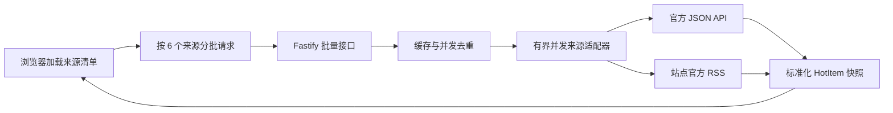

# 更多真实数据源扩展实现计划

## 需求理解

- **目标**：在坚持“只展示真实上游数据、不使用 Mock 填充生产页面、不绕过登录或反爬”的前提下，把 News Spot 从 6 个来源扩展到至少 14 个已实现来源，并让腾讯云生产环境稳定启用至少 10 个来源，覆盖国内、科技、国际和财经四个分类。
- **现状**：来源定义集中在 [`apps/api/src/config/sources.js`](../../apps/api/src/config/sources.js)，适配器由 [`apps/api/src/sources/registry.js`](../../apps/api/src/sources/registry.js) 静态注册，统一经过 HTTP 客户端、Zod 契约、两级缓存、熔断和调度器。前端 [`apps/web/src/composables/useSources.js`](../../apps/web/src/composables/useSources.js) 会把全部来源一次性传给批量接口，而 [`apps/api/src/routes/batch.js`](../../apps/api/src/routes/batch.js) 最多接受 12 个来源；因此来源总数超过 12 时，当前首页会整体加载失败。
- **线上基线**：2026-09-15 腾讯云生产环境中 Hacker News、IT之家可返回新鲜真实数据；V2EX、BBC 存在超时，GitHub 匿名请求会遇到 403，Bilibili 返回风控状态。新增来源前必须先解决冷启动请求突发和生产来源启停策略，否则数量增加会放大超时与健康告警噪声。
- **约束**：优先官方 API、站点自己发布的 RSS/Atom；不抓取正文，不解析需要频繁适配的 HTML，不依赖 Cookie，不绕过验证码、付费墙或访问控制。每个新来源必须支持独立开关、确定性 fixture 单测、腾讯云在线 smoke 和失败时旧快照降级。
- **方案**：首批接入 DEV Community、Stack Overflow、Lobsters、少数派、Solidot、TechCrunch、NPR World、MarketWatch。先把前端改为分批渐进加载，把调度器改为有界并发和错峰启动，再复用通用 RSS 适配器接入 6 个 RSS 源，并为两个官方 JSON API 编写专用适配器。当前高失败来源不删除代码，通过生产环境开关进入观察池。

## 已核验来源与分期

以下连通性均为 2026-09-15 从实际部署主机 `tencent-cloud` 发起的只读探测结果；响应成功只代表当前可达，正式启用仍以连续 smoke 和站点使用条款为准。

| 分期 | 来源 | 分类 | 获取方式 | 腾讯云探测 | 决策 |
|---|---|---|---|---|---|
| P0 | Stack Overflow | tech | 官方 Stack Exchange API `/2.3/questions?sort=hot` | 200，约 1.0 秒 | 首批启用；遵守 `backoff` 与 `quota_remaining` |
| P0 | DEV Community | tech | 官方 Forem Articles API，公开读取 | 200，约 7.7 秒 | 首批启用；单次超时设为 12 秒、减少重试 |
| P0 | Lobsters | tech | 站点 RSS `/rss` | 200，约 1.2 秒 | 首批启用；按 feed 顺序作为排名 |
| P0 | 少数派 | china | 站点 RSS `/feed` | 200，约 0.08 秒 | 首批启用 |
| P0 | Solidot | china | 站点 RSS `/index.rss` | 200，约 0.28 秒 | 首批启用 |
| P0 | TechCrunch | tech | 站点 RSS `/feed/` | 200，约 0.98 秒 | 首批启用 |
| P0 | NPR World | world | NPR World RSS | 200，约 1.3 秒 | 首批启用 |
| P0 | MarketWatch | finance | 站点公开 Top Stories RSS | 200，约 0.85 秒；最新条目为当天内容 | 首批启用；只展示 RSS 摘要和原文链接 |
| P0 补充 | Ars Technica | tech | 站点 RSS | 200，约 1.1 秒 | GitHub 与 Hacker News 同时波动时补足实时成功余量 |
| P1 | GitHub | tech | 已有官方 Search API | 生产匿名请求偶发 403 | 配置 Token 后继续启用，否则保留旧快照并降频 |
| 观察池 | V2EX、BBC | tech/world | 已有公开 API/RSS | 腾讯云多次超时 | 生产默认关闭，定时探测恢复后再启用 |
| 观察池 | Bilibili | china | 非正式 Web API | 返回风控 `-352` | 生产默认关闭，不增加规避风控逻辑 |
| 暂缓 | arXiv | tech | 官方 RSS | 15 秒仅下载部分约 1.38 MB feed | 源过大，暂不进入首页热点链路 |
| 暂缓 | CoinGecko | finance | 官方 Keyless/Demo API | 腾讯云连接超时；Keyless 官方说明不适合生产轮询 | 获得 Demo Key 且网络恢复后再评估 |
| 暂缓 | The Guardian | world | 官方 Content API | 测试请求 401 | 仅在提供正式 API Key 后接入 |
| 排除 | WSJ Markets RSS | finance | 站点 RSS | 返回 200，但最新条目停留在 2025-01-27 | 不以陈旧 feed 充当实时来源 |
| 排除 | 微博、知乎、抖音等 | china | 登录态或非公开接口 | 未作为 P0 探测 | 不纳入本阶段，避免高维护反爬链路 |

外部依据：DEV 使用 [Forem 官方 API](https://developers.forem.com/api/v0)，Stack Overflow 使用 [Stack Exchange 官方 questions API](https://api.stackexchange.com/docs/questions)；CoinGecko 仅保留为后续候选，因为其[官方 Keyless API 文档](https://docs.coingecko.com/docs/keyless-public-api)明确指出不适合生产定时轮询。

## 一、建立可扩展的来源加载与调度基线

涉及文件：[`apps/web/src/composables/useSources.js`](../../apps/web/src/composables/useSources.js)、[`apps/web/src/composables/useSources.test.js`](../../apps/web/src/composables/useSources.test.js)、[`apps/api/src/services/scheduler.js`](../../apps/api/src/services/scheduler.js)、[`apps/api/src/services/hot-service.js`](../../apps/api/src/services/hot-service.js)、[`apps/api/src/lib/http-client.js`](../../apps/api/src/lib/http-client.js)、[`apps/api/test/services.test.js`](../../apps/api/test/services.test.js)

1. 将首页初始加载从“全部来源一次请求”改为每批 6 个、顺序执行的渐进加载；每批完成立即合并到 `results`，单批失败只标记该批来源，不覆盖已经成功的结果。继续保留服务端最多 12 个来源的批量上限，避免通过放宽接口限制制造冷启动并发洪峰。
2. 将“全部刷新”改为并发度 3 的任务队列，而不是对全部来源直接 `Promise.allSettled`；单源刷新行为和服务端强制刷新限流保持不变。
3. 调度器初始预热不再把所有来源随机塞进前 2 秒，而是按来源数均匀分散到 60 秒窗口，并限制同时执行的刷新任务不超过 3 个；后续周期继续保留 jitter，进程关闭时清理等待队列和 timer。
4. 在 HTTP 客户端增加每次调用可覆盖的 `retryCount`，传给原生 `fetch` 前剥离该内部字段。默认行为保持当前最多重试两次；DEV 等高延迟源使用 12 秒超时但最多重试一次，RSS 快速源继续使用 8 秒和默认重试策略。
5. 保持缓存和 SQLite schema 不变：现有快照表以 `source_id` 为键，可以直接容纳新来源，不需要数据库迁移。继续复用 24 小时真实旧快照、单飞刷新和熔断逻辑。

验收：`useSources` 单测覆盖 14 个来源时分成 3 批、渐进合并、第二批失败后第一批仍保留、取消请求；服务层单测用假时钟验证 14 个来源不会在 2 秒内同时刷新，并断言并发数不超过 3。

## 二、扩展来源契约、配置与注册表

涉及文件：[`apps/api/src/config/env.js`](../../apps/api/src/config/env.js)、[`apps/api/src/config/sources.js`](../../apps/api/src/config/sources.js)、[`apps/api/src/sources/registry.js`](../../apps/api/src/sources/registry.js)、[`packages/contracts/src/index.js`](../../packages/contracts/src/index.js)、[`.env.example`](../../.env.example)、[`packages/contracts/test/contracts.test.js`](../../packages/contracts/test/contracts.test.js)

1. 在环境 schema 中增加 8 个 `SOURCE_<ID>_ENABLED` 布尔开关，并同步 `.env.example`。代码默认开启 P0 新来源；腾讯云共享 `.env` 单独关闭 V2EX、BBC、Bilibili，GitHub 是否启用由 `GITHUB_TOKEN` 配置结果决定。
2. 在 `createSourceDefinitions` 中登记新来源的稳定 ID、展示名称、现有四类分类、主页、刷新周期、超时、风险等级和数据方式。财经首个来源使用 `marketwatch`，从而让现有 `finance` 分类不再为空。
3. 保持 `SourceDefinition` 的公开字段不变，不把 feed URL、API Key 或内部重试策略暴露给浏览器。RSS feed URL 和 JSON endpoint 留在服务端适配器配置中。
4. 将注册表中的硬编码映射拆成清晰的 `apiAdapters` 与 `rssAdapters`：JSON 结构差异大的来源保留专用函数；RSS 来源通过私有 feed 配置生成适配器。未知或未注册适配器仍返回 `ADAPTER_MISSING`，不能静默返回空列表。
5. 扩展唯一 ID、分类、数据方式和新环境开关的契约测试；确认旧来源响应格式完全兼容，前端不需要为新来源增加专用字段分支。

验收：`pnpm --filter @news-spot/contracts test` 和 `pnpm --filter @news-spot/api typecheck` 通过；`GET /api/v1/sources` 能返回 14 个已实现来源，且不会包含 feed URL、Token 或重试配置。

## 三、实现两个官方 API 适配器

涉及文件（拟新增）：[`apps/api/src/sources/devto.js`](../../apps/api/src/sources/devto.js)、[`apps/api/src/sources/stackoverflow.js`](../../apps/api/src/sources/stackoverflow.js)、[`apps/api/test/fixtures/upstreams/devto.json`](../../apps/api/test/fixtures/upstreams/devto.json)、[`apps/api/test/fixtures/upstreams/stackoverflow.json`](../../apps/api/test/fixtures/upstreams/stackoverflow.json)；涉及修改：[`apps/api/test/sources.test.js`](../../apps/api/test/sources.test.js)

1. DEV Community 调用公开 Articles API，以 `top=7` 获取近一周热门文章；映射文章 ID、标题、公开 URL、正向反应数加评论数作为可解释的 `score`、描述和发布日期。响应为空、URL 非法或缺少标题时由统一 schema/空数据规则判定失败。
2. Stack Overflow 调用 Stack Exchange API v2.3 的 questions endpoint，使用 `sort=hot`、`site=stackoverflow` 和固定 `pagesize`；映射 question ID、标题、`link`、score 加 answer count、创建时间，并正确解码 API 返回的 HTML entity。
3. Stack Exchange 响应存在 `backoff` 时，将该来源下一次允许请求时间写入适配器级内存状态；调度器或用户刷新在 backoff 窗口内返回可重试错误并使用旧快照。记录 `quota_remaining` 到调试日志或无敏感指标，但不改变公共 `HotItem` 契约。
4. 两个适配器仅执行读取，不配置写 API 权限；fixture 从真实响应裁剪和脱敏，生产构建不依赖 fixture。

验收：适配器单测覆盖正常映射、缺失字段、空列表、DEV 超时、Stack Exchange `backoff` 与 quota 接近耗尽；执行 `pnpm --filter @news-spot/api test -- sources.test.js`。

## 四、用通用 RSS 链路接入六个来源

涉及文件：[`apps/api/src/sources/rss-source.js`](../../apps/api/src/sources/rss-source.js)、[`apps/api/src/lib/rss.js`](../../apps/api/src/lib/rss.js)、[`apps/api/src/sources/registry.js`](../../apps/api/src/sources/registry.js)、[`apps/api/test/sources.test.js`](../../apps/api/test/sources.test.js)；拟新增 fixtures：`apps/api/test/fixtures/upstreams/{lobsters,sspai,solidot,techcrunch,npr-world,marketwatch}.xml`

1. 为 Lobsters、少数派、Solidot、TechCrunch、NPR World、MarketWatch 配置各自的站点 RSS URL，复用现有 `fetchRssSource` 输出标准 `HotItem`；feed 顺序即排名，不伪造“热度分”。
2. 增强通用 RSS 解析的兼容性，只处理实测出现的 RSS/Atom 差异：CDATA、HTML entity、`guid`、`link`、`pubDate`/ISO 时间和缺失摘要。摘要继续限制 500 字符并去除标签，不抓取原文正文。
3. 稳定 ID 优先使用合法 `guid`，否则基于原文 URL；重复 URL 在同一 feed 内只保留排名最靠前的一条。原文链接必须属于 HTTP/HTTPS，跳转仍由前端直接打开源站。
4. MarketWatch 文章只展示 feed 提供的标题、摘要和链接，不抓取、缓存或尝试还原正文；该边界写入 README 来源说明。

验收：六份独立 fixture 均至少验证 3 条真实条目、排名、稳定 ID、原文 URL 和发布时间；增加一次含重复项、非法链接和缺失摘要的通用 RSS 边界测试。

## 五、优化多来源前端状态与可观察性

涉及文件：[`apps/web/src/App.vue`](../../apps/web/src/App.vue)、[`apps/web/src/components/SourceCard.vue`](../../apps/web/src/components/SourceCard.vue)、[`apps/web/src/composables/useSources.js`](../../apps/web/src/composables/useSources.js)、[`apps/web/src/components/SourceCard.test.js`](../../apps/web/src/components/SourceCard.test.js)、[`apps/api/src/routes/health.js`](../../apps/api/src/routes/health.js)、[`apps/api/src/routes/metrics.js`](../../apps/api/src/routes/metrics.js)

1. 保持现有卡片、分类和 Design DNA，不做页面重设计；随着批次完成逐卡片从 `loading` 进入 `fresh`、`stale` 或 `error`，顶部 loading 只在仍有批次运行时显示。
2. 分类计数继续统计已启用来源；财经分类因 WSJ Markets 自动出现内容。来源展示顺序由配置定义决定，不因瞬时失败频繁重排，避免界面跳动。
3. 健康接口继续区分 fresh/stale/error/unknown，并补充不破坏现有字段的 `availabilityRatio`；监控目标改为“启用来源中至少 8 个有 fresh/stale 快照”，同时保留任一错误导致 `degraded` 的诊断语义。
4. metrics 保留逐源成功率、连续失败、平均/P95 耗时；新增来源上线后据此判断是否从 P0 降级到观察池。日志不记录上游正文、feed 内容或 Token。

验收：组件测试覆盖分批 loading、财经分类计数、错误卡不影响其他卡；路由测试覆盖 14 个来源的健康统计和 `availabilityRatio` 边界。

## 六、腾讯云灰度发布与来源准入

涉及文件：[`apps/api/scripts/smoke.js`](../../apps/api/scripts/smoke.js)、[`README.md`](../../README.md)、[`.env.example`](../../.env.example)、[`scripts/deploy.mjs`](../../scripts/deploy.mjs)；外部运行配置：`/opt/news-spot/shared/.env`

1. 扩展在线 smoke 输出每个来源的成功、旧数据、条目数、耗时和错误类别；通过 `SMOKE_MIN_SUCCESS` 配置最低成功数，开发默认 8，腾讯云上线门禁设为 10。在线 smoke 仍不进入普通单测，避免外部波动阻塞本地开发。
2. 首次上线先启用 8 个新来源及当前稳定的 Hacker News、IT之家；V2EX、BBC、Bilibili 在腾讯云 `.env` 中关闭。GitHub 仅在配置有效 Token 并通过 smoke 后计入 10 个来源门禁。
3. 部署后连续观察 24 小时：每个 P0 来源至少成功刷新 3 次，成功率不低于 80%，P95 不超过其超时值，且不能出现连续 3 次熔断。未达到标准的来源通过单独环境开关关闭，不回滚其他来源或数据库。
4. 运行 `npm run deploy` 前后分别保存 `/api/v1/metrics` 和 `/api/v1/health` 摘要。应用级回滚继续使用现有镜像发布机制；单源故障优先关闭来源开关并重启容器，SQLite 中既有真实快照和其他来源数据不受影响。
5. README 增加来源准入表、公开 API/RSS 链接、刷新频率、已知限制和生产启停方式，明确“实现来源数”“生产启用数”“当前在线数”是三个不同指标。

验收：在生产容器运行 `docker exec news-spot node apps/api/scripts/smoke.js`，至少 10 个已启用来源返回非空真实数据；公网首页 14 张以内卡片能渐进加载，任一来源断开时其他来源仍正常；`curl -fsS https://hot-spots.kevinlau.cn/api/v1/health/live` 返回 200。

## 完整需求专项检查

- **接口 Mock**：项目没有运行时 Mock，也不应为新增来源引入生产 Mock 分支。现有 `apps/api/test/fixtures/upstreams/` 和注入式 `http` 已能回放真实响应样本；本阶段沿用该模式，为每个新适配器提供裁剪后的 fixture，覆盖正常、空数据和结构变化。前端沿用 composable 注入的假 API 测试分批加载，不新增 MSW 等基础设施。
- **单元测试**：项目已配置 Vitest、Fastify inject 和 Vue Test Utils，现有来源、服务、路由与组件用例可直接扩展。单元测试是主要验收方式，重点覆盖适配器标准化、RSS 差异、Stack Exchange backoff、分批加载、调度并发和单源失败隔离；在线 smoke 与浏览器验收只作为真实网络补充。

## 验证顺序

1. `pnpm --filter @news-spot/contracts test`
2. `pnpm --filter @news-spot/api test -- sources.test.js services.test.js routes.test.js`
3. `pnpm --filter @news-spot/web test`
4. `pnpm lint && pnpm typecheck && pnpm build`
5. `pnpm --filter @news-spot/api test:smoke`，本地至少 8 个真实源成功。
6. `npm run deploy`，随后在腾讯云容器执行 `SMOKE_MIN_SUCCESS=10 node apps/api/scripts/smoke.js`。
7. 公网检查首页、四个分类、分批加载、单源刷新和错误降级；检查 `/api/v1/health`、`/api/v1/metrics` 及 24 小时连续刷新结果。

## 明确不做

- 本阶段不接入需要 Cookie、登录态、验证码或非公开签名算法的微博、知乎、抖音、小红书等来源。
- 不为 Bilibili 风控增加代理池、Cookie 轮换、浏览器自动化或其他规避策略。
- 不抓取或存储文章全文，不绕过来源站点的付费墙，只使用 feed/API 明确返回的元数据并跳转原站。
- 不放宽批量接口为无限来源，不引入 Redis、消息队列或多节点调度；当前单实例通过分批和并发队列即可支撑本阶段规模。
- 不做跨来源语义去重、个性化推荐、用户收藏或账号系统；这些与“可靠增加真实来源”分开评估。
- CoinGecko、The Guardian、arXiv 仅保留候选记录，本阶段不以不可达、大体积或缺少凭据的来源凑数量。

## 实施跟踪规则

- 实施过程中以本文末尾 TODO 为进度依据。
- 开始任务前先读取 TODO；每完成一个可独立验收的交付项并通过相关验证后，立即将对应的 `- [ ]` 更新为 `- [x]`。
- 不要等全部开发结束后一次性勾选，不得在缺少验证结果时提前勾选。
- 遇到阻塞时保持未勾选，并在该项后补充阻塞原因。
- 新发现的必要工作应补充为新的 checkbox，不得删除未完成事项。

## TODO

- [x] 将前端初始加载改为每批 6 个来源渐进请求，并将全部刷新限制为并发 3，完成取消、局部失败和 14 来源用例。
- [x] 将调度器改为 60 秒错峰预热和并发 3，并为 HTTP 客户端增加逐请求重试次数覆盖，完成假时钟与并发测试。
- [x] 增加 8 个来源开关、定义和注册映射，保持公共契约不泄露上游配置，并通过契约与环境配置测试。
- [x] 实现 DEV Community 与 Stack Overflow 官方 API 适配器，覆盖 backoff、quota、超时、空数据和真实 fixture。
- [x] 通过通用 RSS 链路接入 Lobsters、少数派、Solidot、TechCrunch、NPR World、MarketWatch，并覆盖六份独立 fixture 与 RSS 边界。
- [x] 补充多来源渐进状态、财经分类、健康可用率和 metrics 验证，保持现有 UI 视觉与响应契约兼容。
- [x] 扩展在线 smoke、README 和环境变量说明，完成全部 lint、类型检查、单测与构建。
- [x] 接入 Ars Technica 官方站 RSS 作为第 15 个已实现来源，补足两个匿名 API 同时波动时的生产成功余量。
- [x] 灰度发布到腾讯云，生产关闭 V2EX、BBC、Bilibili，12 个已启用来源中 11 个通过真实数据 smoke；公网首页显示 12 张来源卡片且浏览器控制台无错误。
- [ ] 24 小时观察已结束但未全部达标：Hacker News 成功率 70.8%、P95 11.6 秒、连续失败 4 次并进入熔断；GitHub 成功率 79.4%。其余 10 个来源成功率均不低于 99.9%，生产快照可用率 100%。按最新产品要求保留失败来源并在前端置底，不自动关闭。
